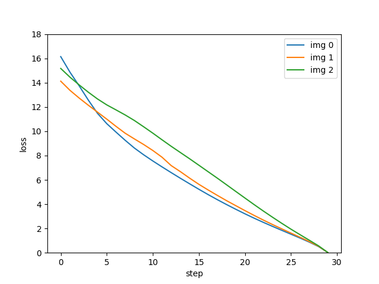

# ComfyUI-LossTesting

Basic utility for testing diffusion model loss across the timestep schedule. Should work with any native models that use ksampler. This could be used for comparing models, testing captions on an image, etc.

